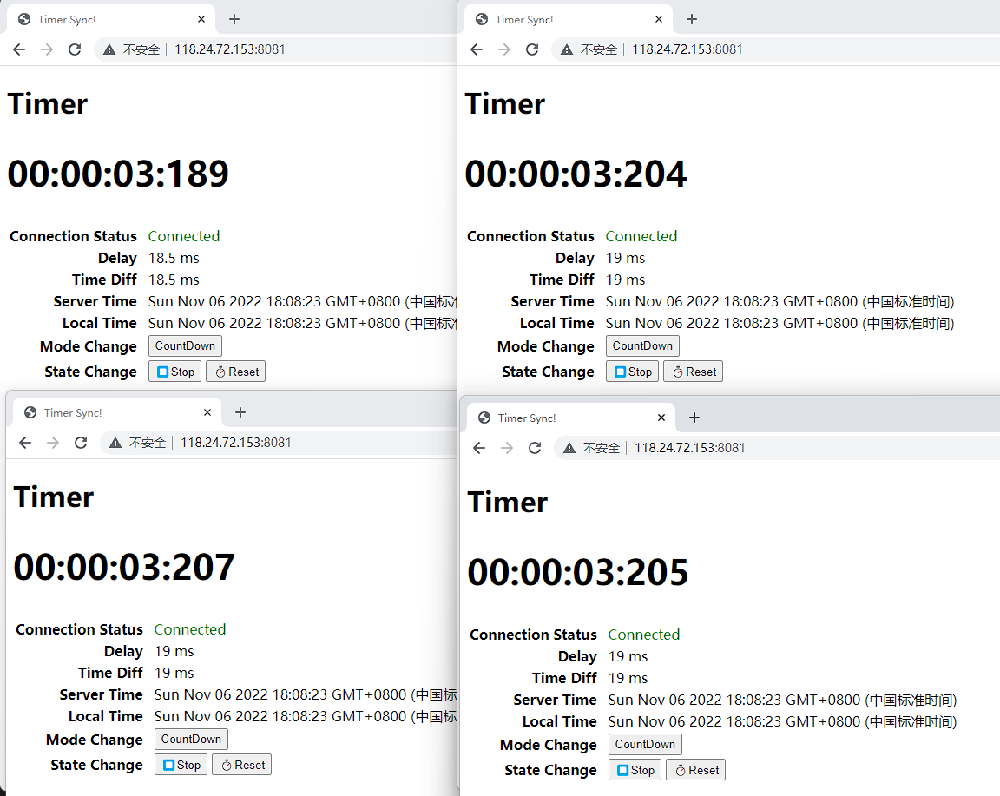

# Timer Sync

A timer Demo that synchronizes multiple clients using trust.

## Online Demo
[http://118.24.72.153:8081/](http://118.24.72.153:8081/)

### CountDown

### Timer

## Principle

### Time Synchronization
The client sends time T1, the server sends time T2 after receiving the message, and the client records time T3 after receiving the message.

The network delay between the server and the client can be recorded as `Delay=(T3 - T1) / 2`.The time difference between the server and the client (different devices have different time) can be recorded as `diff_time = T2 + Delay - Now()`.The client can use `diff_time` to calculate the current server time.

### Status Synchronization
All state attributes of the timer are saved in the server. The client sends a message to modify the state of the timer in the server, and then broadcasts it to all clients.

When the client receives the status information sent by the server, it saves the information and starts to continuously calculate the accumulated time of the timer or the remaining time of the countdown.

##### `mode`
Timer mode. `Timer`/`CountDown`

##### `state`
Running state. `Start`/`Stop`.

##### `time`
The start time of the timer or the end time of the countdown.

##### `counter`
The accumulated time of the timer or the remaining time of the countdown.

### Error Analysis
We can see from the figure that the values of the four timers or countdowns displayed in the screenshot are inconsistent. The error mainly comes from two aspects.

#### Network Delay
We used diff_ Time=T2+Delay - Now() to calculate the difference between local time and server time for conversion between local time and server time. T2+Delay represents the current time of the server. Delay represents the difference between the time when the server sends the response and the time when the response arrives at the client. The problem is that Delay cannot be calculated accurately. We can only use (T3 - T1)/2 to estimate the value of Delay.

#### Refresh rate
The client refreshes the display value of the timer at a fixed frequency. Different client tasks have different execution times, and the calculated values are different. This error is usually within a dozen milliseconds. You can reduce this error by increasing the refresh rate.